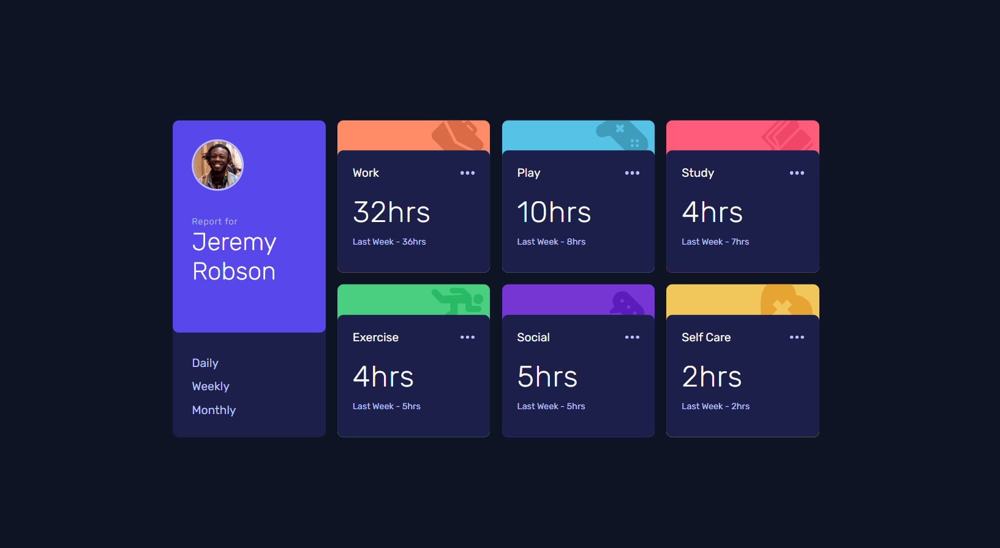
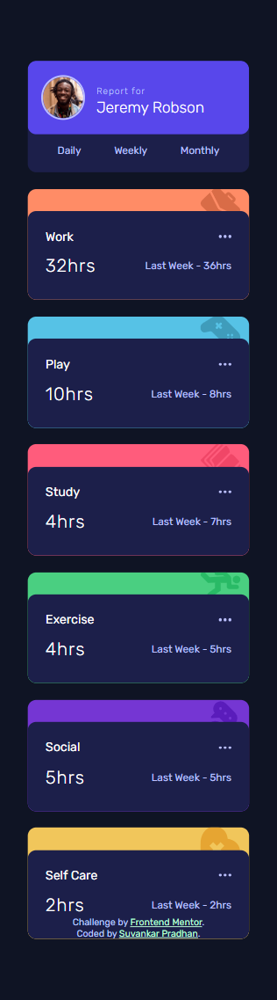

# Frontend Mentor - Time tracking dashboard solution

This is a solution to the [Time tracking dashboard challenge on Frontend Mentor](https://www.frontendmentor.io/challenges/time-tracking-dashboard-UIQ7167Jw). Frontend Mentor challenges help you improve your coding skills by building realistic projects.

## Table of contents

- [Overview](#overview)
  - [The challenge](#the-challenge)
  - [Screenshot](#screenshot)
  - [Links](#links)
- [My process](#my-process)
  - [Built with](#built-with)
  - [What I learned](#what-i-learned)
- [Author](#author)

**Note: Delete this note and update the table of contents based on what sections you keep.**

## Overview

### The challenge

Users should be able to:

- View the optimal layout for the site depending on their device's screen size
- See hover states for all interactive elements on the page
- Switch between viewing Daily, Weekly, and Monthly stats

### Screenshot

### Links

- Solution URL: [Click here](https://github.com/suvankarpradhan/time-tracking-dashboard-main)
- Live Site URL: [Click here](https://suvankarpradhan.github.io/time-tracking-dashboard-main/)

## My process

Here I have used basic html, css to create this design. In css I have used grid and flex both.

### Built with

- Semantic HTML5 markup
- CSS custom properties
- Flexbox
- CSS Grid

**Note: These are just examples. Delete this note and replace the list above with your own choices**

### What I learned

By doing this challenge, I am able to know about my html and css skill.

## Author

- Frontend Mentor - [@suvankarpradhan](https://www.frontendmentor.io/profile/suvankarpradhan)
